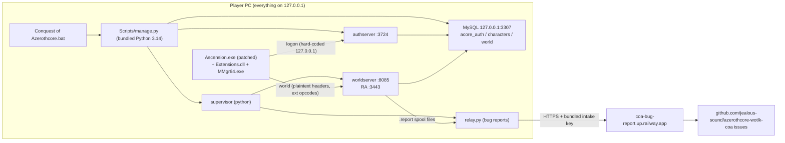

# MuffinCore Project Audit — 2026-09-13

Scope: everything under `E:\MuffinCoreRepack\MuffinCore` (the git repo `Brbmuffins/MuffinCore`), including the server source inside `MuffinCore2.1\Source\server-source.zip` (extracted read-only for this audit), both server installs, the client install, logs and launcher scripts.

Nothing in the project was modified during this audit. Only two things were run: a read-only `update.py --check` (file hashes only, no services started) and log/binary reads.

Path conventions used below:

- `2.1\…` = `MuffinCore2.1\…`
- `Active\…` = `Conquest Of Azerothcore\…` (the install you actually play; it has your characters)
- `src:…` = a file inside `MuffinCore2.1\Source\server-source.zip` → `server-source/…`
- `mod:…` = `src:modules/mod-ascension-compat/…`

---

## TL;DR

1. **Don't "commit all" in GitHub Desktop yet.** The repo root holds ~50 GB of untracked files: the 44 GB Ascension client, MySQL data directories, `Settings\database.json`, and a bundled bug-report API key. Pushing would fail on GitHub's size limits at best and publish the client and secrets at worst. Add a `.gitignore` first (proposal in §9). Deleting the old bot-AI files is fine (you confirmed that removal is intentional).
2. **The 12 fixes from the 09-12 release (#21–#35) are not in the game you play.** `Active\Server` is still on `client-compat-20260911`. The update files were unpacked into the *root* of `MuffinCore2.1`, where `Apply_Update.bat` can't find the repack. `MuffinCore2.1` doesn't need the update anyway: it already *is* the 09-12 build. A read-only `--check` against `Active\Server` **passed**. Procedure in §3.
3. **Friends can't connect to a shared server on your VPS with this client as it stands.** This is the biggest decision for the launcher phase. The patched `Ascension.exe` has its logon host hard-coded to `127.0.0.1`, and the server only enables the Ascension protocol quirks for loopback connections. The repack is built as "every player runs their own local server". Details in §5 (F1).
4. **In-game bug reports from every install are auto-enabled and published to someone else's public GitHub repo** (`jealous-sound/azerothcore-wotlk-coa`, through a Railway service using a key bundled in `relay.py`). That includes your friends' reports.
5. **Nobody can currently rebuild the server.** The binaries were built elsewhere, the source zip is "curated", and the data generators plus client-overlay sources are missing. Every C++ change, including a proper GM command system, first needs a working build (§5 F2).
6. GM tooling mostly exists already (it's stock AzerothCore). The real gaps are "learn everything" for the 21 custom classes (stock `.learn all my class` learns nothing for them) and a dev-flag gate. See §8.

---

## 1. What this project is

**MuffinCore** is your branding of the **"CoA Repack"**: a portable Windows package running a fork of AzerothCore (WoW 3.3.5a server emulator) with a large custom module that emulates Ascension's *Conquest of Azeroth* mode (21 custom classes, Manastorm, collections) for a patched Ascension client.

- Upstream source: `https://github.com/jealous-sound/azerothcore-wotlk-coa` (`2.1\RELEASE.json:4`)
- The "Conquest of Azerothcore" client+server bundle and its launcher were packaged by "DnD" (`Active\Instructions.txt`).

### 1.1 Folder map

| Path | What it is | State |
|---|---|---|
| `.git` | Repo `Brbmuffins/MuffinCore`, 2 commits (Feb 2026) with an old bot-AI module | 26 tracked files deleted locally (intentional); everything else untracked |
| `Conquest Of Azerothcore\Conquest of Azerothcore.bat` | DnD's menu launcher (start/stop server, create account, start client) | In use |
| `Conquest Of Azerothcore\Client\` | 44 GB patched Ascension 3.3.5a client (`Ascension.exe` + `Extensions.dll` patched, `.ORIGINAL` copies kept) | In use; last played 2026-09-13 09:45 |
| `Conquest Of Azerothcore\Server\` | Server repack, release **client-compat-20260911** (`worldserver.exe` sha256 `c7f5149b…`) | **The live install**: has accounts ADMIN and BRBMUFFINS |
| `Conquest Of Azerothcore\Server\CoA-Repack-Update\` | The *previous* 09-11 update, already applied | Stale; harmless |
| `MuffinCore2.1\` | Full repack, release **issue-fixes-20260912** (`worldserver.exe` `6633ba33…`), never started (`.state` empty) | Newer, unused |
| `MuffinCore2.1\{Apply,Check,Rollback}_Update.bat, update.py, UPDATE.json, Payload\, README.txt` | The 09-12 incremental update, extracted into the wrong place | Misplaced (see B2) |
| `..\MuffinCore.rar` (906 MB), `..\MuffinCoreUpdate.zip` (10 MB) | Full repack archive; the 09-12 update zip (size matches `2.1\RELEASE.json` `incrementalUpdate.bytes`) | Outside the repo |

### 1.2 Differences between the two server installs

| Item | Active\Server (09-11) | MuffinCore2.1 (09-12) |
|---|---|---|
| worldserver.exe | `c7f5149b…` | `6633ba33…` (+ #21–#35 fixes) |
| authserver.exe | `cfb0c89a…` | same |
| Settings templates, relay.py, bats | same | same |
| `Scripts\manage.py` | older; DnD changed one message | adds interrupted-reset guard |
| `Clean_Database.bat`, `Scripts\reset-database.py`, `Database\Clean\` | **absent** | present |

---

## 2. Architecture overview



### 2.1 Server: what runs where

**Management layer (Python, `Scripts\manage.py`)**

- `prepare()` regenerates `Core\configs\*.conf` from `Settings\*.template` on **every** start. Edits made directly to `Core\configs` are lost; edit the templates instead (`manage.py:176-219`).
- Starts MySQL, then authserver, then a supervisor that spawns worldserver and restarts the relay if it dies (`manage.py:279-307`, `:390-411`).
- Forces the realmlist to `127.0.0.1` on every start (`manage.py:260`).
- Stops the server gracefully over RA (`server shutdown`) using `raUsername/raPassword` from `Settings\repack.json`.
- `create-account` and `console` go through RA as well.

**Update layer (`update.py`, per release)**

- A strict, single-purpose updater: hash-checked payload, source-zip patching, DB snapshots, rollback.
- Hard-wired to specific release IDs, migrations and table hashes (`update.py:16-26`, `:177-190`).
- It is not a general-purpose delta updater (relevant for the launcher phase).

**Reset layer (`reset-database.py`, 2.1 only)**

- Factory-resets all three DBs from `Database\Clean`, with automatic backup and a `Restore_Backup.bat`.
- Only works when the snapshot's `serverIdentity` matches the installed exe hashes (`reset-database.py:186`).

**C++ server (AzerothCore fork)**

- Stock AzerothCore, plus hand edits in core files for custom classes (`SharedDefines.h:137-157`, 21 class IDs 12–32), Ascension protocol handling, stats, spells and quests.
- Core files with Ascension edits: `WorldSocket.cpp`, `AuthSession.cpp`, `CharacterHandler.cpp`, `Player.cpp`, `Unit.cpp`/`Unit.h`, `StatSystem.cpp`, `Spell*.cpp`, `SpellAura*`, `ItemTemplate.h`, `QuestDef.cpp`, `ObjectMgr.cpp`, `DBCStore.cpp`, `CharacterDatabase.cpp`.

**`mod-ascension-compat` (~270 files, the heart of the project)**

- **Protocol adapter** (`AscensionCompat.cpp`): consumes extension opcodes 1311–2515, handles the collections protocol, chat-command endpoints used by the client UI (`.local*`) and custom resources.
- **Class services**: progression, specializations, CoA talent tree data (`AscensionCoATalentData.h`, 189 KB, generated), starter kits, proficiencies.
- **Per-class mechanics**: files named `Ascension<Class>{Abilities,Auras,Contracts,Events,Summons}.cpp`, registered in `mod:src/MP_loader.cpp`.
- **Manastorm** (`AscensionManastorm*.{cpp,h}`, ~200 KB): a roguelike dungeon mode with its own DB tables `ascension_manastorm_*`.
- **CoA bug reports** (`CoABugReport.cpp`, `CoABugReportService.h`): in-game reports sent as addon whispers and written to spool files.
- **Changelog compat** (`AscensionChangelogCompat.cpp`): patches SpellInfo values at load from `AscensionChangelogData.h`.
- **SQL**: `mod:data/sql/db-world` (custom class tables, 25 MB of appearance item templates) and `db-characters` (collections).
- **Tests**: Python + C++ harnesses (`mod:tests/*`) and GoogleTest units in `src:src/test/server/game/*`.

### 2.2 Client

- **`Ascension.exe`** is patched: 78 bytes differ, plus a 1.5 KB added section. The original's `logon.worldofwarcraft.com:3724` is replaced by `127.0.0.1`. `Data\enUS\realmlist.wtf` is empty (0 bytes) and effectively ignored.
- **`Extensions.dll`** is patched: ping timer changed from −30000 to −5000 ms (`mod:README.md:50-57`).
- **Custom overlays** live in modified MPQs: `Data\patch-B.MPQ` (16 MB, modified 09-10, `.ORIGINAL` kept) and `Data\patch-T.MPQ` (modified 09-07). They contain the Manastorm UI, bug-report adapter, Necromancer/Templar UI and so on. **The Lua/XML sources for these overlays exist only inside the MPQs.**
- Other client pieces: `MMgr64.exe` + `MemoryBridge` (an Ascension helper process talking to the client over IPC; log at `Client\MemoryBridge.log`), bundled addons (ElvUI suite, Recount, AtlasLoot, Auctionator), and `Data\Content\*.json` data for Ascension features.

**Client vs server split:** every gameplay rule is server-side. The client provides the UI (talent tree, collections, Manastorm, help and bug report) and sends requests through extension opcodes or `.local*` chat commands.

---

## 3. The pending update: what happened and how to apply it

**What went wrong:**

- `Apply_Update.bat` expects to sit *inside* a `CoA-Repack-Update` folder that lives inside the repack. It looks for `%~dp0..\Runtime\python\python.exe` (`2.1\Apply_Update.bat:4-7`).
- It was extracted into the repack root instead, so the parent folder (`MuffinCore\`) has no `Runtime` and the script stops.

**Why it doesn't matter for `MuffinCore2.1`:** that folder already contains the target `worldserver.exe` (`6633ba33…`), and its DB ships with the migrations (`2.1\RELEASE.txt`).

**Where it belongs:** `Active\Server`. Verified 2026-09-13:

```
update.py --root "Conquest Of Azerothcore\Server" --check
→ Update payload and installed package version are compatible. No services were started or changed.
```

**Procedure (not done yet; waiting for your go-ahead):**

1. Close the game. Run `Active\Server\Stop_All_Server.bat` and wait for "All services … are stopped".
2. Rename `Active\Server\CoA-Repack-Update` to `CoA-Repack-Update-20260911-applied`.
3. Extract `MuffinCoreUpdate.zip` so you get `Active\Server\CoA-Repack-Update\Apply_Update.bat`.
4. Run `Check_Update.bat`, then `Apply_Update.bat`.
   - The updater backs up to `Active\Server\Update-Backups\issue-fixes-20260912`, applies the two world migrations, starts the server and verifies it.
   - Accounts, characters and inventory are preserved.
   - `Rollback_Update.bat` restores the previous state.
5. Optional: to get Clean_Database/factory-reset support in the active install, copy `Clean_Database.bat`, `Scripts\reset-database.py`, `Scripts\manage.py` and `Database\` from `MuffinCore2.1`. This only works after the update, because the snapshot is tied to the `6633ba33…` exe.
6. Then decide what `MuffinCore2.1` is for: discard it, or keep it as the clean "golden" release to build from.

---

## 4. Bug list

Severity reflects impact on **your current use** (local play plus handing builds to friends). Items that only become serious on a shared or exposed server say so.

| ID | Sev | Summary | Evidence |
|---|---|---|---|
| B1 | **Critical** | Committing the working tree would push ~50 GB, including the client, DB data and secrets | `git status`: `?? "Conquest Of Azerothcore/"`, `?? MuffinCore2.1/` |
| B2 | **High** | 09-12 fixes not applied to the live install; update misplaced | §3; hashes; `Apply_Update.bat:4-7` |
| B3 | **High** | Bug reports auto-enabled and published to upstream author's public repo with a bundled key | `manage.py:207`, `relay.py:21-25` |
| B4 | High (shared server) / Low (solo) | `.localtalent` grants any paid talent at any rank with **no point cost or budget check** | `mod:src/AscensionCompat.cpp:3149-3262` |
| B5 | Medium (Critical if any port is exposed) | Known-password GM accounts are shipped, and anyone creating an account is offered GM 3 | `Active\Instructions.txt:25-26`, `2.1\README.txt`, `manage.py:449`, `Settings\repack.json` |
| B6 | Medium | Start reports "failed" whenever the relay isn't ready, even though worldserver is up | `manage.py:309-317`, called from `start_world` |
| B7 | Medium | Unbounded log growth plus debug/trace logging left on | `manage.py:223` (`"ab"`); `world-console.log` = 73 MB after ~30 starts; `auth template:412,432` (level 6); `world template:786`; compat `LogConsumedPackets = 1` |
| B8 | Medium (suspected) | Three Venomancer venom script sets are compiled but never registered | `mod:src/MP_loader.cpp` doesn't call functions defined at `AscensionVenomancerVenomPayloads.cpp:103`, `…VenomProcs.cpp:187`, `…VenomTalents.cpp:277` |
| B9 | Low | Loopback detection is inconsistent: string `== "127.0.0.1"` in some places, `is_loopback()` in others | `src:…/CharacterHandler.cpp:292,1247`, `src:…/Player.cpp:10154` vs `src:…/WorldSocket.cpp:130,338,627` |
| B10 | Low | Launcher starts the client **as Administrator** (UAC prompt every time; WTF/Cache end up admin-owned) | `Active\Conquest of Azerothcore.bat:146` (`-Verb RunAs`) |
| B11 | Low | Launcher's "server started" flag is a guess | `…bat:83,101` |
| B12 | Low | `Clean_Database.bat` has no `pause`, so the window closes before you can read the recovery-backup path | `2.1\Clean_Database.bat:8` |
| B13 | Low | Stale or misleading config text | `mod:conf/mod_ascension_compat.conf.dist:64-67`; `Core\configs\modules\*.conf` contain packager path `C:/Ascension/CoA-Repack` (overwritten at start) |
| B14 | Low | Startup error noise hides real errors | `world-console.log` per start: 208 × `spell_proc … wrong HitMask 32767`, 116 × missing ItemSet names |
| B15 | Low | Warden anti-cheat enabled against a patched client | `world template:1167` (`Warden.Enabled = 1`, fail action 0) |
| B16 | Low | Client log errors | `Client\Logs\FrameXML.log`, `Error.txt`, `MemoryBridge.log` |
| B17 | Info | `Instructions.txt` says to "check `Server\CoA-Repack-Update` for updates", but that folder is the already-applied 09-11 update | `Active\Instructions.txt` |

### Details and minimal fixes

**B1 — repo hazard.**

- Tracked content today is only the old bot module. The untracked tree includes:
  - `Client\` (44 GB; files over GitHub's 100 MB limit)
  - `mysql\data` (live DB, including account password verifiers)
  - `Settings\database.json` (MySQL root/app passwords)
  - `BugReport\relay.py` (a live intake key)
  - `Update-Backups`/`Database-Backups`, once they exist
- **Fix:** add a `.gitignore` before the next commit (§9). *Needs your decision on what to track.*

**B2 — update not applied.** See §3. **Fix:** run the procedure. *Needs your OK*, because it replaces the server binary and changes world tables (with backup and rollback).

**B3 — bug-report destination.**

- `prepare()` always writes `CoABugReport.Enable = 1` (`manage.py:205-208`), and the supervisor always starts the relay.
- The relay posts to Railway with a bundled key (`relay.py:25`), creating **public issues on `jealous-sound/azerothcore-wotlk-coa`** that contain class, level, map, coordinates and whatever the player typed (`mod:docs/github-bug-reports.md`).
- If that service or key is revoked, reports get stuck as `blocked`/`uncertain`.
- **Options:** (a) disable, by writing `Enable = 0` in `prepare()` and skipping the relay spawn; (b) repoint to your own repo with your own service; (c) keep as-is on purpose. *Your call.*

**B4 — free talents.**

- The handler checks class, spec, level, max rank and free-choice groups, then calls `learnSpell` directly. `AECost`/`TECost` are only used to classify automatic entries (`AscensionCompat.cpp:3203`), and there's no budget check anywhere in the module.
- It's a `SEC_PLAYER` command because the client talent UI drives it, so gating it to GMs would break the UI.
- Intent is unclear: this may be deliberate "solo convenience", like `UnlockAllVanity`. **Question for you:** should talents cost Ability/Talent Essence? If yes, the minimal fix is a per-character spent-points check in this handler plus in `SynchronizeProgression`.

**B5 — credentials.**

- Current credentials:
  - `local`/`local` (GM 3) from the upstream release
  - `Admin`/`Password` (GM 3) from DnD's bundle; the auth log confirms ADMIN logins
  - RA login `local`/`local`
  - `Create_Account` asks "Give this account GM permissions? [y/N]"
- Every port binds to `127.0.0.1` (world template:107, auth template:66, `manage.py:211`), so nothing is reachable off-machine today.
- **Fix when distributing:** ship with no GM accounts, generate per-install RA credentials on first run, and remove the GM prompt from the player-facing launcher.

**B6 — false start failure.**

- `start_world` waits for the world port, the RA port, then `wait_relay()`, which raises after 20 s.
- The launcher then says "The action failed" while the game is actually playable.
- **Minimal fix:** make the relay check a warning (print and continue) instead of an exception.

**B7 — logs.**

- worldserver stdout is appended to `Core\Logs\world-console.log` forever.
- authserver runs at trace level (it logs every SQL statement, including account names), and the Ascension path logs SRP fingerprints (`src:…/AuthSession.cpp:613`).
- **Minimal fix:** rotate or truncate `*-console.log` in `spawn()` when over N MB; set `Logger.root=3` and `Appender.Auth` level 3 in the auth template; set `AscensionCompat.LogConsumedPackets = 0` and `Logger.network=3`.

**B8 — Venomancer scripts.**

- The unregistered registration functions would have bound:
  - venom payload base-value scaling (`AscensionVenomancerVenomPayloadMetadata`, `…VenomBaseValues`)
  - `aura_ascension_venomancer_venom_proc`
  - the Intoxicating talent lifecycle/login hooks, `spell_ascension_venomancer_intoxicating_mycosis` and `…_extension`
- No SQL in the source binds those script names, so this is either dead code superseded by `AscensionVenomancerContracts.cpp:347` (which applies the same level curve) or an unfinished merge.
- **Don't wire it in blindly:** it could double-apply scaling. **Fix path:** play a Venomancer and test Intoxicating talents and venom procs in game, then either register the three functions (plus DB bindings) or delete the files.

**B9 — loopback checks.** The string compare misses `127.0.0.2` and `::1`. The patched client always uses exactly `127.0.0.1`, so there's no impact today. **Fix:** replace the string compares with `GetSession()->GetSocket()`-style `is_loopback()`, or better, a single `IsAscensionClientSession()` helper. This matters for F1.

**B10 — admin launch.** Replace the PowerShell `-Verb RunAs` call with a plain `START "" /D "%~dp0Client" "%CLIENT_EXE%"`. *Easy fix; left for your OK because it's DnD's launcher.*

**B11 — guessed server state.** The launcher sets the flag to 1 right after `START` without checking whether worldserver actually came up. "Create Account [Ready]" can then fail with "Start this repack's worldserver first." **Fix:** re-run the `TASKLIST` check when the menu is drawn.

**B12 — no pause.** Add `pause` before `exit /b` in `Clean_Database.bat`.

**B13 — stale config text.**

- The dist comment says "solo levels 10-59, three scenes, depths 1-15" and `Enable = 0`. The template and docs say Manastorm is enabled, with 61 rooms (30 admitted) and depths up to 16384.
- **Fix:** update the comment.

**B14 — log noise.**

- 0x7FFF sets undefined bits 0x1000 and 0x4000 (`PROC_HIT_MASK_ALL = 0x2FFF`, `src:…/SpellMgr.h:271`). The loader only logs this (`SpellMgr.cpp:2149`), so procs still work.
- **Fix:** a follow-up SQL that masks `HitMask & 0x2FFF` for those 208 rows. Never edit applied migrations.

**B15 — Warden.** No gameplay effect, just wasted work and noise. **Fix:** set `Warden.Enabled = 0` in the template, or leave it.

**B16 — client log errors.**

- `Ascension_GMTools` and `DevelopmentXML` are referenced but missing (§6).
- `AtlasLoot\Core\MapData.lua` and `Databases\extraCraftingData.lua` fail to load.
- ~20 "Virtual object … already exists" warnings: `Ascension_Collections` embeds `Ascension_TalentUI`, which also loads standalone.
- `ChallengeMgr` can't find challenge data.
- `MemoryBridge` repeatedly logs `command 109 returned oversized_message` (1,117,418-byte response), so some helper-process feature fails silently.
- A crash dump from 09-11 (`Client\Errors\…Crash.txt`, ACCESS_VIOLATION at 0x004E204F) came from the packager's machine; it hasn't recurred here.

---

## 5. Fundamental issues (architectural, not bugs)

### F1 — Local-only by design. **Blocks a shared VPS server. Decide before the launcher phase.**

Everything that makes the Ascension client work is restricted to one machine:

- **Client:** logon host patched to `127.0.0.1` inside `Ascension.exe`; `realmlist.wtf` isn't used.
- **World protocol:** plaintext world headers after auth (`WorldSocket.cpp:627-644`), acceptance of extension opcodes (`:338-343`) and the 5-second ping allowance (`:130`) all apply only when `is_loopback()`. A remote Ascension client would be disconnected for a "malformed packet" on its first extension opcode, or break on header encryption.
- **Class/spell layouts:** class-10 mapping (`CharacterHandler.cpp:292`) and the Ascension spell-modifier packet layout (`CharacterHandler.cpp:1247`, `Player.cpp:10154`) are also loopback-only.
- **Ops:** `manage.py:260` and `reset-database.py:241` force the realm address to `127.0.0.1`; auth, world, MySQL and RA all bind `127.0.0.1`.
- **Auth:** the unpatched-Ascension auth path maps every login to account `LOCAL` for *any* source IP (`AuthSession.cpp:312-319`). It's dead with the patched exe but must be removed before anything is exposed.

Two viable distribution models:

- **Model A: each friend runs their own local repack** (current design). The launcher distributes and updates client + server files; everyone plays solo. It needs no protocol changes and fits §7 directly.
- **Model B: one shared server on your VPS.** This needs: re-patching the client logon host (or a hosts-file/redirect approach); removing or replacing the loopback gates with a per-session "Ascension client" flag; a security review (plaintext world headers over the internet mean no header encryption); real account management; fixing B4/B5; and disabling solo conveniences (`UnlockAllVanity`, level scaling and so on). This is a multi-week project in its own right.

**Verdict:** the choice doesn't have to happen now, but it must happen before §7 design starts, because the manifest/launcher looks very different under A and B.

### F2 — No reproducible build. **Fix before any C++ work.**

- The exes were built on the upstream author's machine (VS2022 RelWithDebInfo per `mod:docs/local-release-state.md`).
- `server-source.zip` is described as "curated source with 25 updated or added members" (`2.1\RELEASE.txt`).
- Referenced tooling is missing from everything shipped:
  - `tools/Generate-LocalCoATalentData.ps1` (generates `AscensionCoATalentData.h` and the client's `CoATalentNodeData.lua`)
  - `apps/coa-world/README.md` (world DB package)
  - `.agents/docs/systems/ascension-local-deployment.md`
  - the client overlay sources
- **Cheapest path:**
  1. Install VS2022 + CMake + MySQL client libs + Boost + OpenSSL.
  2. Build `server-source.zip` unmodified.
  3. Confirm the new worldserver starts cleanly against a *copy* of the DB and behaves like `6633ba33…`.
  4. Put the source under git (§9).
  5. Only then start changing C++.
- Extracting the overlay Lua from `patch-B.MPQ`/`patch-T.MPQ` into a tracked folder is the client-side equivalent.

### F3 — Downstream of an upstream you don't control. **Can wait, but decide consciously.**

- Release IDs, update contracts (`update.py:16-26`), the bug-report destination, `RELEASE.json` provenance and in-docs issue numbers all belong to `jealous-sound`'s project.
- If you keep taking their updates, keep their folder layout and don't hand-edit files their updater hashes: `Core/worldserver.exe`, `Source/server-source.zip`, `RELEASE.*`, `MANIFEST.json`.
- If you fork into MuffinCore proper, you take ownership of versioning, the updater and the bug pipeline, and upstream updates become manual merges.

### F4 — Redistributing the client. **Know the risk before §7.**

- The 44 GB client is Ascension's patched build of Blizzard's client. Hosting it for download from your VPS carries copyright and ToS exposure that the server repack itself doesn't.
- Many repack communities ship only the server plus a small client *patch* and require users to supply the base client.
- That choice also changes the delta-update math enormously (10 MB patches vs a 44 GB base).

### F5 — Repo root = working install. **Fix now (cheap).** The git root is the folder that *contains* live installs with DBs and logs. See §9.

---

## 6. Missing and unfinished pieces

| # | Item | Evidence | Notes |
|---|---|---|---|
| U1 | **Classless CoA mode** (Ascension "class 10") | compat template:14-16 (`mod:conf/…conf.dist:14-16`); `CharacterHandler.cpp:292-299` | Mapped to a stock Warrior "until the classless progression backend is added" |
| U2 | **Uneven class completeness.** *Completion-documented (14):* Barbarian, Cultist, Felsworn, Guardian, Knight of Xoroth, Necromancer, Pyromancer, Starcaller, Sun Cleric, Templar, Tinker, Venomancer, Witch Doctor, Witch Hunter. *Targeted code only:* Ranger, Reaper, Runemaster, Primalist, Chronomancer (2 spells), Bloodmage (attack-power fix). *No dedicated code:* Stormbringer | `mod:docs/*-completion.md`; per-class source files; `SharedDefines.h:137-157` | All 21 are creatable (`2026_08_27_00_ascension_custom_classes.sql`). Docs repeatedly note **no in-game acceptance testing** |
| U3 | Orphaned Venomancer venom/talent scripts | B8 | Wire in or delete after testing |
| U4 | Missing generators, world-DB package docs and deployment docs | `mod:README.md:22,28,36` | F2 |
| U5 | Client overlay sources not in any repo | `mod:docs/github-bug-reports.md` ("supplied separately in the matching client overlay") | Only inside `patch-B.MPQ`/`patch-T.MPQ` |
| U6 | Manastorm partial | `mod:docs/manastorm.md` | 30 of 61 rooms admitted; 3 of the client's affixes implemented; no ability-card rewards; exact drop rates invented locally; "not a manual in-game combat run" |
| U7 | Bug-report relay tests never run against Railway | `mod:docs/github-bug-reports.md` ("were not run, following the owner's request") | No retention; uncertain reports need manual repair |
| U8 | **Custom login screen/logo started but assets missing** | `Client\Logs\MissingFiles.txt`: `Interface\Glues\MainMenu\ConquestAzerothCore.blp`, `Interface/GlueXML/Nightwish-Nemo.mp3` | Glue code references a custom logo and login music that were never shipped. **This is the hook for your logo swap** (§10) |
| U9 | Ascension GM Tools and dev console UI referenced, not shipped | `FrameXML.log`: `Ascension_GMTools\*.xml`; `GlueXML.log`: `Interface\DevelopmentXML\Glue\DevConsole.xml`, `DevelopmentUtil.lua`, `PTRClient.xml` | Ascension's internal GM/dev addons were stripped from the client |
| U10 | Client feature data with no server side | `Client\Data\Content\`: `HandOfFateQuestData.json`, `SkillCardData.json`, `EnchantmentTo*Suggestion*.json`; `Transmogrification*.json` and `WorldMapAreaData.json` are **0 bytes** | Hand of Fate, skill cards, suggestions and transmog UIs are probably inert |
| U11 | Disabled 1.9 GB content patch | `Client\Data\patch-WB1.MPQ.DISABLED` | Cut or conflicting content; worth knowing before building delta patches |
| U12 | Active install lacks the reset tooling | §1.2 | Copy from 2.1 after updating |
| U13 | Muffin Companions bot module | git history (`d607f8f`), `.mbot` commands | Removed intentionally (per you); was never compiled into this server |
| U14 | Monitoring stack shipped but off | `src:apps/grafana`, world template `Metric.Enable = 0`, `SOAP.Enabled = 0` | Useful later for a VPS server |

---

## 7. Hidden feature inventory

### 7.1 Module chat commands (`mod:src/AscensionCompat.cpp:3111-3123`, `AscensionManastorm.cpp:2034-2047`)

| Command | Access | What it does |
|---|---|---|
| `.localfreshcheck` | Admin, console/RA only | Diagnostic that simulates fresh custom-class characters and checks starter kits and progression. Needs no players online (`AscensionFreshCharacterCheck.h`) |
| `.localtalent <entry> <rank>` | **Player** | Sets a CoA talent rank; used by the talent UI (see B4) |
| `.localspec <id>` | Player | Switches CoA specialization |
| `.localclassrepair` | Player | Re-syncs progression and proficiencies and restores missing starter-kit items. **Great first thing to try on a broken character** |
| `.localresource` | Player | Prints custom resource status (Life Force, Heat, etc.) |
| `.localcharges` | Player | Resends spell-charge state (Runemaster Echoes) |
| `.localappearance <cat> <id>` | Player | Applies a collection appearance |
| `.localvanity <itemId>` | Player | Delivers a vanity item; with `UnlockAllVanity = 1` that's **any** vanity item |
| `.manastorm enter [depth] \| start \| next \| leave \| status` | Player | Manastorm control without the queue UI |

### 7.2 Server toggles (all in `Settings\mod_ascension_compat.conf.template`)

- `UnlockAllVanity`, `UnlockLocalAppearanceCatalog`, `AppearanceCatalogPerCategory`: everything unlocked
- `AutoCollectAppearances`, `AllowLearnedSpellDelivery`, `LearnOwnedCompanions`
- `MaxRidingFromStart`: 300 riding plus Cold Weather Flying at level 1
- `LevelScaling` (mobs more than 3 levels below you are raised) and `QuestLevelScaling`
- `Ascension.Manastorm.Enable`
- `MapClass10ToWarrior`, `LogConsumedPackets`, `PlaintextWorldHeaders`

### 7.3 Systems you may not know are there

- **Account-wide collections.** DB tables `account_appearance_collection`, `account_vanity_collection`, `character_appearance*`.
- **Manastorm roguelike:**
  - 61-room catalog across 19 dungeons, solo to 5-player scaling (AutoBalance curve), 5 shared resurrections per floor
  - Cogsley vendor with 107 gadget upgrade entries, 4 loadout slots, caches delivered to bags with retry
  - Treasure Keeper, first-clear Bedlam Bullion, Bonzo Bolts
  - Everything persisted transactionally
- **In-game "Send to GitHub" bug reports** from the Ascension Help UI (B3).
- **Changelog compat:** spell values patched at load to match Ascension's live changelog.
- **Custom resources**, per-class **racial ability matrix**, ammo display overrides, healing stat selectors, conditional combat rules.
- **Ops tooling:**
  - `World_Console.bat` (RA console; any GM command from outside the game)
  - `Status_Server.bat`
  - `Clean_Database.bat` with automatic backups plus `Restore_Backup.bat`
  - `update.py --check/--rollback`
- **Dev tooling in source:**
  - `tools/socket_stress_heavy.py` (network stress test), `tools/check_repository.py`
  - `apps/grafana` dashboards, `docker-compose.yml`, `apps/DatabaseSquash`, `apps/config-merger`
  - `mod:tests/client_compat/run.py`, `mod:tests/manastorm/{run,solo_tuning}.py`, `mod:tests/bugreport/test_relay.py`, `mod:tests/test_{starter_templates,automatic_talent_dependencies}.py`
  - GoogleTest units in `src:src/test/server/game/…`
- **Stock AzerothCore GM/dev commands** (all present, `src:src/server/scripts/Commands/cs_*.cpp`): `.gm`, `.cheat`, `.debug` (~45 subcommands), `.dev`, `.learn`, `.levelup`, `.character`, `.tele`, `.go`, `.additem`, `.modify`, `.morph`, `.npc`, `.gobject`, `.wp`, `.reload`, `.lookup`, `.spellinfo`, `.packetlog`, `.pooltools`, `.mmaps`, `.disable`, `.worldstate`, `.instance`, `.reset`, `.ban`, `.rbac`. See §8.
- **Client extras:**
  - `Blizzard_DebugTools` (`/framestack`, `/eventtrace`)
  - ElvUI + Enhanced + AddOnSkins + ExtraActionBars, Recount, AtlasLoot (incl. Vanity), Auctionator with a price DB
  - The `MMgr64.exe`/MemoryBridge helper
  - Tutorial cinematics `TUTORIAL_1-4.avi`

---

## 8. GM / dev command status

Current gating: GM level in `acore_auth.account_access` (3 = admin), plus RBAC. There's no dev flag, and both shipped GM accounts have public passwords (B5).

| You want | Existing command(s) | Stock classes | Custom classes 12–32 | Gap |
|---|---|---|---|---|
| Set level to max | `.levelup 79` (self or target), `.character level <name> 80` | ✅ | ✅ level; stats per `player_class_stats` (levels 2–80 **fixed only by the pending update**, #23); progression syncs on level change | Apply update first |
| Grant all spells | `.learn all my class` / `trainer` / `talents` | ✅ | ❌ learns nothing: it walks class *trainers* (`cs_learn.cpp:122-152`), and 12–32 have none. CoA talents can only be set one entry at a time with `.localtalent`; automatic entries come from `.localclassrepair` | **Build `.muffin learnall [spec]`**: iterate `CoATalentEntries` for class and spec at max rank, then `SynchronizeProgression` |
| Noclip / fly | `.gm on`, `.gm fly on`, `.modify speed all 10`, `.modify speed fly 10` | ✅ | ✅ | The 3.3.5 client has no true noclip; fly plus `.go xyz` is the standard substitute |
| Teleport | `.tele <name>`, `.tele name <player> <loc>`, `.go xyz/creature/gameobject/graveyard/taxinode/trigger/zonexy`, `.appear`, `.summon`, `.recall`, `.gps` | ✅ | ✅ | Optional saved bookmarks (`.tele add`) |
| Spawn items | `.additem <id\|link> [count]`, `.additem set <id>`, `.lookup item <name>`, `.localvanity <id>` | ✅ | ✅ (needs item_template) | — |
| God mode | `.cheat god`, `.cheat cooldown`, `.cheat casttime`, `.cheat power`, `.cheat status`, `.die`, `.revive`, `.modify hp/mana` | ✅ | ⚠️ `.cheat power` covers native power types; module-managed resources (Life Force, Heat, …) are untested | Verify in game |
| Debug overlays | `.debug los/mapdata/threat/combat/areatriggers/visibilitydata/zonestats`, `.showarea`, `.gps`, `.dev on`, `.localresource`; client `/framestack`, `/eventtrace` | ✅ | ✅ | Ascension's GM/dev UI addons aren't shipped (U9) |
| Economy / progress | `.modify money`, `.modify reputation`, `.cheat taxi`, `.cheat explore`, `.maxskill`, `.learn all crafts/recipes` | ✅ | ✅ | — |
| Manastorm testing | `.manastorm enter <depth>` | n/a | n/a | Checkpoint rules still apply; add a GM override to jump to any depth |

### Proposed consolidation (for your approval, not started)

- **Phase 1, no C++ (possible today):** a `GM_COMMANDS.md` cheat sheet of the commands above, plus a `Dev_Setup.bat` that uses the RA console to create a personal GM account with a password you choose.
- **Phase 2, C++ (needs F2's build first):** one `.muffin` command namespace in the module, registered only when `MuffinCore.DevTools.Enable = 1`.
  - Default is `0` in the shipped template. When disabled the commands **don't exist** (they aren't just hidden).
  - Each command also requires GM 3.
  - Commands: `.muffin max` (level 80, all CoA talents, riding, max skills, full resources), `.muffin learnall [spec]`, `.muffin god` (wraps cheat god/cooldown/casttime/power), `.muffin fly [speed]`, `.muffin tp <preset>`, `.muffin kit <class>` (gear set), `.muffin overlay` (toggles LOS/area/GPS), `.muffin storm <depth>` (Manastorm override).
- **Phase 2 shipping hygiene:** drop the known GM accounts, remove the GM prompt from `Create_Account`, and randomize RA credentials on first run (B5).

---

## 9. Proposed `.gitignore` and repo layout (for your decision)

Minimum safe `.gitignore` if the repo stays rooted at `MuffinCore\`:

```gitignore
# Client (44 GB, third-party, never commit)
Conquest Of Azerothcore/Client/

# Runtime state, databases, secrets, logs
**/mysql/data/
**/mysql/logs/
**/mysql/my.ini
**/mysql/admin-client.ini
**/Settings/database.json
**/.state/
**/Core/Logs/
**/Core/configs/*.conf
**/Core/configs/modules/*.conf
**/BugReport/reports/
**/BugReport/Logs/
**/Update-Backups/
**/Database-Backups/

# Large binaries and archives (track hashes in release notes instead, or use Git LFS)
**/Data/maps/
**/Data/vmaps/
**/Data/mmaps/
**/Data/dbc/
**/Data/Cameras/
**/mysql/bin/
**/mysql/lib/
**/Runtime/
**/Database/Clean/*.gz
**/Source/server-source.zip
**/Payload/Core/*.exe
*.rar
*.zip
*.exe
*.dll
```

**Relay key:** `BugReport/relay.py` contains the upstream intake key. Excluding it or replacing the key is your call (B3).

**Longer term (recommended):** track *source* rather than installs.

- Extract `server-source.zip` into `server/`.
- Put overlay Lua/XML in `client-overlay/`.
- Keep `tools/` (launcher, updater, build scripts) and `docs/` alongside.
- Produce installs as build outputs, and keep them outside the repo or ignored.

---

## 10. Art/UI swap notes (logo and loading screens)

- **Logo hook already exists:** the client's glue code asks for `Interface\Glues\MainMenu\ConquestAzerothCore.blp` and `Interface\GlueXML\Nightwish-Nemo.mp3` and doesn't find them (`MissingFiles.txt`). A BLP at that path in a new patch MPQ should appear on the login screen without Lua changes. Placement and size need an in-game check.
- **Loading screens** are `Interface\Glues\LoadingScreens\*.blp`, referenced by `LoadingScreens.dbc`. Custom art means replacing BLPs with the same names in an overlay MPQ; new names need DBC edits.
- **Tools needed:**
  - an MPQ editor (e.g. Ladik's MPQ Editor, or StormLib via script)
  - a BLP converter (BLPConverter or BLPLab): PNG in, BLP2 (DXT/uncompressed) out, dimensions as powers of two
- **Overlay rule:** patch MPQs load in name order, and `patch-B`/`patch-T` already carry local changes (keep their `.ORIGINAL`s). Put new art in its **own** new MPQ, not inside those two, so art updates stay tiny and independent. The exact load order of letters above `Z` in this Ascension build needs a quick test.

---

## 11. Distribution/launcher: facts for later (not starting until you say so)

- **What exists:** a per-release, hash-contracted incremental updater (`update.py`) plus a `MANIFEST.json` (3 MB, file list with hashes) in each release. Good raw material for a manifest, but the updater is single-purpose (F3).
- **Size profile:**
  - client 44 GB (mostly static; a few MPQs change)
  - server ~3.2 GB, of which `Data\` is ~1.2 GB static and `mysql\` ~1.6 GB of *per-user* state that must never be overwritten
  - a typical release delta is ~10 MB (worldserver.exe + SQL)
- **Design depends on F1 (Model A or B) and F4 (whether you ship the client).**
- **Butler vs Velopack vs Squirrel vs custom** gets evaluated in the §7 design, as you asked. One early note: Velopack and Squirrel target app installers with a single exe; Butler (itch.io) does binary patching for large game folders; a "manifest + per-file hash + HTTP range" script is also realistic here because DB state must be excluded and migrations run.

---

## 12. Open questions for you

1. Distribution **Model A** (everyone runs their own local server) or **Model B** (shared server on your VPS)? (F1)
2. Bug reports: disable, repoint to your own repo, or keep sending upstream? (B3)
3. Should CoA talents cost points, or is free respec/unlock intended? (B4)
4. Do you plan to keep pulling updates from `jealous-sound`, or fork fully into MuffinCore? (F3)
5. Will you redistribute the client, or require friends to already have it? (F4)
6. OK for me to apply the 09-12 update to `Active\Server` (§3)?
7. What should `MuffinCore2.1` become: discard, or the clean baseline?
8. Do you have (or want me to set up) a Windows C++ build environment: VS2022, CMake, Boost, OpenSSL, MySQL dev libs? (F2)

---

## 12a. Status updates

**2026-09-13, later the same day**

- **B1 addressed.** `.gitignore` added; the untracked set dropped from ~50 GB to ~100 files (~10 MB). `BugReport/relay.py` and `Settings/database.json` are ignored.
- **B2 fixed.** The 09-12 update was applied to `Conquest Of Azerothcore/Server`.
  - The zip hash matched `RELEASE.json`, and `--check` passed.
  - A manual auth+characters dump was saved first (`Database-Backups/manual-pre-issue-fixes-20260913`).
  - Result: `worldserver.exe` = `6633ba33…`, `RELEASE.json` releaseId `issue-fixes-20260912`, both migrations recorded in `acore_world.updates`, all 3 characters and 4 accounts intact, updater backup phase `complete`, all services running.
  - No new startup error types compared with the previous run.
  - Rollback stays available through `Server/CoA-Repack-Update/Rollback_Update.bat` until in-game testing is done.
- **Stale files archived** (moved, not deleted) to `E:\MuffinCoreRepack\_archive\2026-09-13-post-update\`: the applied 09-11 update folder and `MuffinCoreUpdate.zip`. The stray update files in the `MuffinCore2.1` root are pending (a review is still reading them).
- **New B18 (Low–Medium).** Custom-class characters get skills the core strips on relog. On login, Human Venomancer "Alianthaya" (class 29) logged `has skill (113) … invalid for the race/class combination … Will be deleted` and `has spell (2764) that teach skill (176) … Will be deleted` (`world-console.log`). 113 is the Darnassian language skill and 176/2764 is Thrown/Throw.
  - Something in the custom-class starter or racial data grants them, and `SkillRaceClassInfo` doesn't allow them for class 29.
  - Check whether it recurs on the updated build (#25 changed racial handling).
- **New B19 (Info).** `--config` doesn't accept the install path with spaces. Every worldserver start logs `the argument ('…\Conquest Of Azerothcore\Server\Core\configs\worldserver.conf') for option '--config' is invalid`, and the server falls back to its default relative config path (the same file, because the working directory is `Core`). Harmless today, but it would bite if the working directory or layout changed. Paths without spaces avoid it.
- **Hosting direction.** Tyler wants to host for friends on an Ubuntu VPS (details later). Since the repack is Windows-only, F2 (a reproducible build, including on Linux) is now a hard prerequisite for hosting.
- **Corrections from the hosting research** (`codex-out\HOSTING_PLAN.draft.md`):
  - `realmlist.wtf` is 25 bytes (`set realmlist 127.0.0.1`), not 0 bytes; the §2.2 and F1 statements were wrong, since the earlier listing rounded file sizes to MB. The exe only changes the default, and the real client-side lock is the `Extensions.dll` world-server allowlist.
  - Upstream `main` already contains **PR #61 "Enable remote CoA clients"** (`AscensionCompat.AllowRemoteClients`) and PR #64 (a SpellAuraEffects bounds guard). Our source `26b64e36` lacks both.
  - The research recommends hosting through restricted SSH tunnels to a VPS that stays bound to 127.0.0.1 (not yet tested with a friend).
  - The repo's LICENSE file is reported as GPL-2.0 while source headers say AGPL-3.0. Check this before relying on either.
- **Identity files** added: `AGENTS.md` (shared, read by Codex), `CLAUDE.md` (imports it), `REFERENCES.md` (community data sources), `tools/codex-task.ps1` (Codex offload helper).

## 13. Recommended next actions (in order of leverage)

1. **Add the `.gitignore`** (§9) before the next commit, then commit this audit.
2. **Apply the 09-12 update** to `Active\Server` (§3). It takes minutes, has a rollback, and unblocks correct stats for level testing.
3. **Decide the bug-report destination** (B3). A one-line change in `prepare()` if you choose to disable.
4. **Quick script fixes** once approved: relay failure becomes a warning (B6), log rotation and levels (B7), `pause` in `Clean_Database.bat` (B12), non-admin client launch (B10).
5. **Stand up the server build** and verify it matches `6633ba33…` behavior (F2). This is the prerequisite for all C++ work.
6. **GM tooling:** Phase 1 cheat sheet and dev account now; Phase 2 `.muffin` namespace behind a config flag after step 5 (§8).
7. **Logo and loading screen overlay MPQ** (§10) once you hand me the art or ask for placeholders.
